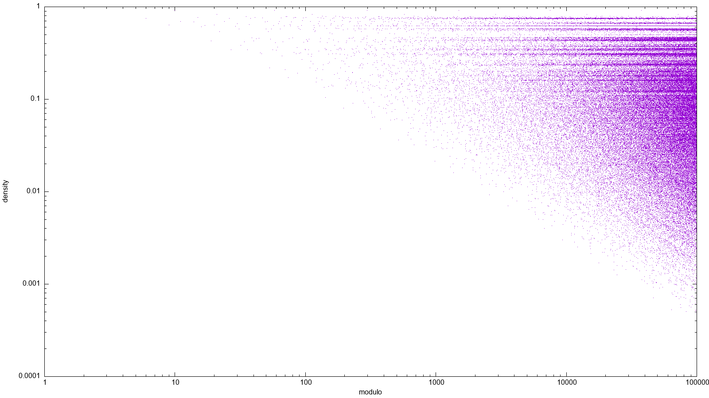

[](https://buy.stripe.com/00gbJZ0OdcNs9zi288)<br>

Plots the Fibonacci sequence modulo some number on a circle.

### [Launch](https://thenumbernine.github.io/glapp-js/index.html?dir=fibonacci-modulo&file=run.lua)

To run the visualization:
`run.lua n=[modulo-number]` 

To make a collage:

```
./1-make-collage-individual.lua
./2-combine-collage.lua
```


Some examples:

2 through 101:


1001:


graph of modulo density:



Here's a list of all n<100,000 that produce dense fibonacci sequences ... and their respective prime factorization:

```
2 : 2
3 : 3
4 : 2, 2
5 : 5
6 : 2, 3
7 : 7
9 : 3, 3
10 : 2, 5
14 : 2, 7
15 : 3, 5
20 : 2, 2, 5
25 : 5, 5
27 : 3, 3, 3
30 : 2, 3, 5
35 : 5, 7
45 : 3, 3, 5
50 : 2, 5, 5
70 : 2, 5, 7
75 : 3, 5, 5
81 : 3, 3, 3, 3
100 : 2, 2, 5, 5
125 : 5, 5, 5
135 : 3, 3, 3, 5
150 : 2, 3, 5, 5
175 : 5, 5, 7
225 : 3, 3, 5, 5
243 : 3, 3, 3, 3, 3
250 : 2, 5, 5, 5
350 : 2, 5, 5, 7
375 : 3, 5, 5, 5
405 : 3, 3, 3, 3, 5
500 : 2, 2, 5, 5, 5
625 : 5, 5, 5, 5
675 : 3, 3, 3, 5, 5
729 : 3, 3, 3, 3, 3, 3
750 : 2, 3, 5, 5, 5
875 : 5, 5, 5, 7
1125 : 3, 3, 5, 5, 5
1215 : 3, 3, 3, 3, 3, 5
1250 : 2, 5, 5, 5, 5
1750 : 2, 5, 5, 5, 7
1875 : 3, 5, 5, 5, 5
2025 : 3, 3, 3, 3, 5, 5
2187 : 3, 3, 3, 3, 3, 3, 3
2500 : 2, 2, 5, 5, 5, 5
3125 : 5, 5, 5, 5, 5
3375 : 3, 3, 3, 5, 5, 5
3645 : 3, 3, 3, 3, 3, 3, 5
3750 : 2, 3, 5, 5, 5, 5
4375 : 5, 5, 5, 5, 7
5625 : 3, 3, 5, 5, 5, 5
6075 : 3, 3, 3, 3, 3, 5, 5
6250 : 2, 5, 5, 5, 5, 5
6561 : 3, 3, 3, 3, 3, 3, 3, 3
8750 : 2, 5, 5, 5, 5, 7
9375 : 3, 5, 5, 5, 5, 5
10125 : 3, 3, 3, 3, 5, 5, 5
10935 : 3, 3, 3, 3, 3, 3, 3, 5
12500 : 2, 2, 5, 5, 5, 5, 5
15625 : 5, 5, 5, 5, 5, 5
16875 : 3, 3, 3, 5, 5, 5, 5
18225 : 3, 3, 3, 3, 3, 3, 5, 5
18750 : 2, 3, 5, 5, 5, 5, 5
19683 : 3, 3, 3, 3, 3, 3, 3, 3, 3
21875 : 5, 5, 5, 5, 5, 7
28125 : 3, 3, 5, 5, 5, 5, 5
30375 : 3, 3, 3, 3, 3, 5, 5, 5
31250 : 2, 5, 5, 5, 5, 5, 5
32805 : 3, 3, 3, 3, 3, 3, 3, 3, 5
43750 : 2, 5, 5, 5, 5, 5, 7
46875 : 3, 5, 5, 5, 5, 5, 5
50625 : 3, 3, 3, 3, 5, 5, 5, 5
54675 : 3, 3, 3, 3, 3, 3, 3, 5, 5
59049 : 3, 3, 3, 3, 3, 3, 3, 3, 3, 3
62500 : 2, 2, 5, 5, 5, 5, 5, 5
78125 : 5, 5, 5, 5, 5, 5, 5
84375 : 3, 3, 3, 5, 5, 5, 5, 5
91125 : 3, 3, 3, 3, 3, 3, 5, 5, 5
93750 : 2, 3, 5, 5, 5, 5, 5, 5
98415 : 3, 3, 3, 3, 3, 3, 3, 3, 3, 5
```
